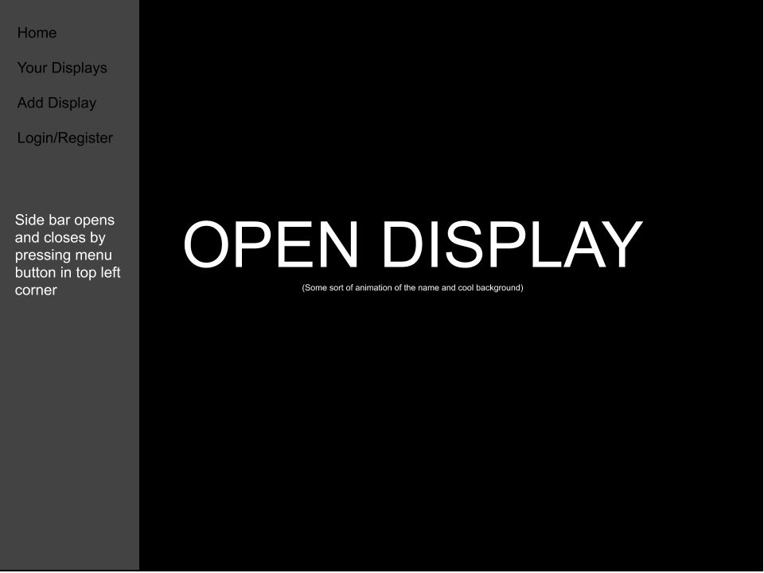
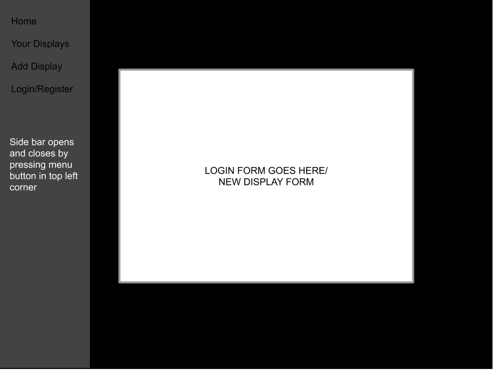
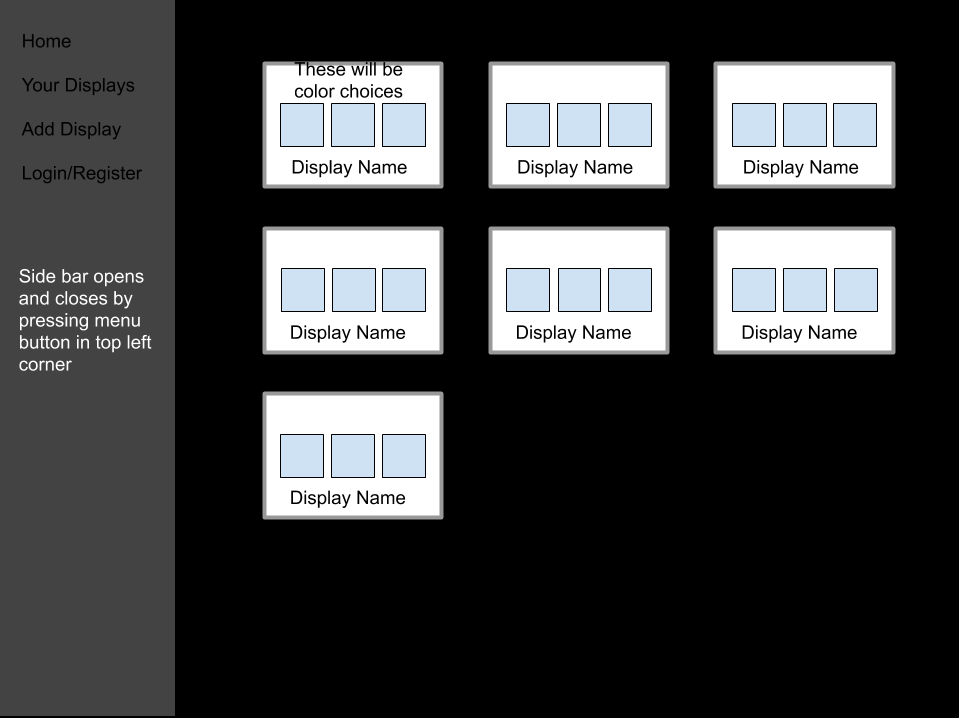
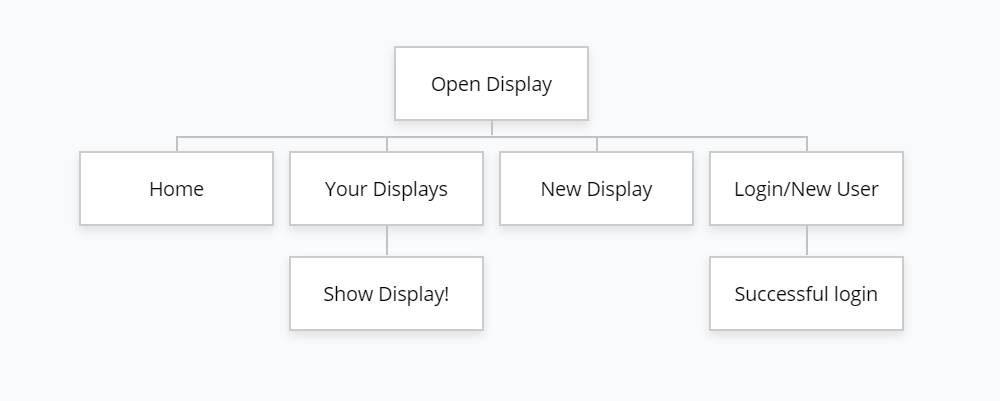

# Open Display

## Overview


During December 2020, Tech@NYU hosted its first Future Arts Fest. I had the idea to do a projected web live installation using processing, and user contributions so attendies of the festival could interact with the art in a strange exciting way. The idea is still being developed, so I will give my best idea of what this project will be like below, and it is very subject to change as we plan and get more ideas.


## Data Model


The application will store Users, displays, and contributions.
* Users can upload as many contributions as they want.
* Contributions will probably be text-based, as that is the easiest to regulate.

An Example User:

```javascript
{
  username: "myUsername",
  hash: // a password hash,
  salt: //salt to add to password attempt to hash
  displays: [123523, 123521]// an array of references to the users uploaded sounds,
}
```

An Example Display:

```javascript
{
  id: 123526 //Numbers which can be used as refereces by users
  name: 'Boopi Beep' //Name of sound given by user
  colors: [] //Array of 3 main colors
  theme: "geometric" //not sure about this one
  responsive: 'sound' //responsive to sound and/or visual or not responsive
}
```

An Example guest contribution:

```javascript
{
  id: 123526 //Which display to send data to
  contribution: "dance davnce dance" //not sure about this one what we are actually going to contribute
  //Might be a drawing or something
}
```


## [Link to Commented First Draft Schema](db.js) 

https://github.com/nyu-csci-ua-0480-001-fall-2019/Brad-Davis-final-project/blob/master/db.js

## Wireframes


/ - home page



/new-display and /login - form to add a display and login



/my-displays - looking at all the displays you have.



## Site map

Here's my site map

## User Stories or Use Cases

1. as non-registered user, I can send changes to a database.
2. as a user, I can log in to the site.
3. as a user, I create a unique and reactive visual display.
4. as a user, I can direct non-registered users to a link which has a form to effect the display.

## Research Topics


* (5 points) Using P5.js to create an exciting reactive visual experience
    * React to audio input.
    * Be visually applealing and fun to look at over a long period of time.
    * Respond to user input to a database.
* (3 points) User authentification.
    * Have user authentificaiton 
    * Have secure hashing (bcrypt)
* (2 points) Realtime input from non-users effecting a p5.js sketch
    * need to learn how to query a database constantly without overloading a system.
    * need to have this query work with p5.js


## [Link to Initial Main Project File](app.js) 

https://github.com/nyu-csci-ua-0480-001-fall-2019/Brad-Davis-final-project/blob/master/app.js

## Annotations / References Used


1. [P5.js](https://p5js.org/reference/)
2. [Coding Train Tutorials/Examples](https://github.com/CodingTrain)
3. [Bcrypt](https://www.abeautifulsite.net/hashing-passwords-with-nodejs-and-bcrypt)

